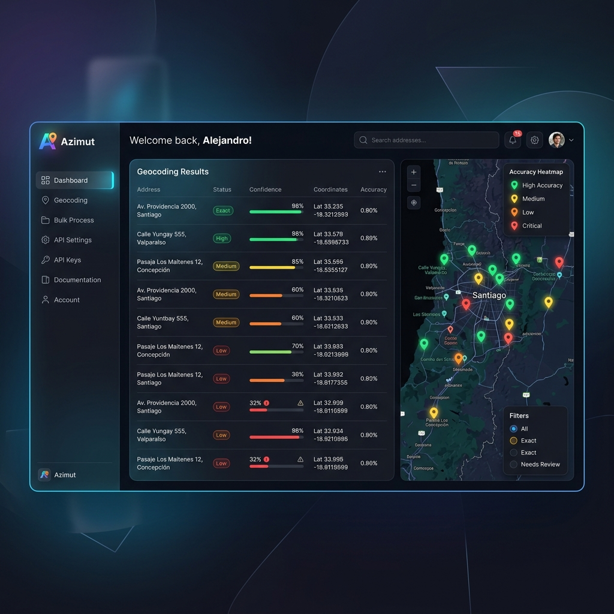

<div align="center">


# 🧭 Azimut

### Geocodificador & Normalizador de Direcciones Chilenas

*Sube un CSV, normaliza, geocodifica y exporta — todo desde el navegador, sin API keys.*

[](https://geoidegeoidal.github.io/azimut/)
[](https://github.com/geoidegeoidal/azimut)
[](https://github.com/geoidegeoidal/azimut)
[](https://github.com/geoidegeoidal/azimut)

<p align="center">
  <a href="https://geoidegeoidal.github.io/azimut/"><strong>🌎 Pruébalo aquí</strong></a>
  ·
  <a href="#-flujo">Flujo</a>
  ·
  <a href="#-normalizador">Normalizador</a>
  ·
  <a href="#-stack">Stack</a>
  ·
  <a href="#-tests">Tests</a>
</p>

<p align="center">
  <a href="https://geoidegeoidal.github.io/azimut/">
    
  </a>
</p>

</div>

---

## 🎯 ¿Qué hace?

<p align="center">
  
</p>

---

## 🧭 Flujo

| Paso | Acción | Qué pasa |
|:----:|--------|----------|
| 1 | 📂 **Sube tu archivo** | Arrastra un CSV o XLSX — detectamos encoding, delimitador y columnas automáticamente |
| 2 | 🔍 **Confirma la columna** | Te sugerimos la columna con direcciones, ves un preview de 10 filas con la normalización |
| 3 | ⚡ **Geocodificamos** | Procesamos 1 dirección por segundo con Nominatim (con fallback a Photon). Pausa, reanuda o cancela cuando quieras |
| 4 | 📊 **Explora resultados** | Dashboard con scores, mapa interactivo con marcadores coloreados, tabla filtrable con detalle |
| 5 | 📦 **Exporta** | 4 formatos: CSV, XLSX (celdas coloreadas), GeoJSON, Shapefile (.zip) |

---

## 🧹 Normalizador Chileno — 7 pasos

<p align="center">
  
</p>

| Paso | Nombre | Qué resuelve |
|:----:|--------|-------------|
| 1 | **SANITIZE** | Remueve teléfonos (+56), RUTs, emails intrusos. Normaliza espacios y puntuación |
| 2 | **TOKENIZE** | Separa componentes: vía, nombre, número, unidad, comuna, región. Detecta Km rurales e intersecciones |
| 3 | **CLASSIFY** | Clasifica cada token según su rol en la dirección |
| 4 | **EXPAND** | `Av→Avenida` · `Pje→Pasaje` · `Stgo→Santiago` · `VdM→Viña del Mar` · `RM→Región Metropolitana` |
| 5 | **VALIDATE** | Coteja contra 346 comunas y 16 regiones oficiales. Fuzzy matching (Levenshtein) para errores de tipeo |
| 6 | **REBUILD** | Formato canónico: `[Vía] [Nombre] [Número] [Unidad], [Comuna], [Región], Chile` |
| 7 | **DIAGNOSE** | Emite warnings y sugerencias: `SIN_NUMERO`, `RURAL`, `SOLO_COMUNA`, `¿Quisiste decir Providencia?` |

### Antes → Después

| Input | Output |
|-------|--------|
| `Av. Providencia 1234` | `Avenida Providencia 1234, Providencia, Región Metropolitana, Chile` |
| `Psje Los Alerces 567 VdM` | `Pasaje Los Alerces 567, Viña del Mar, Valparaíso, Chile` |
| `P 18 N° 2345 Stgo` | `Pasaje 18 2345, Santiago, Región Metropolitana, Chile` |
| `av providencia 1234 dpto 502` | `Avenida Providencia 1234 Departamento 502, Providencia, RM, Chile` |
| `Km 25 Camino a Melipilla` | `Camino a Melipilla Kilómetro 25, Melipilla, RM, Chile` 🟡 RURAL |
| `Los Nogales S/N` | `Los Nogales Sin Número, Chile` ⚠️ SIN_NUMERO |

---

## 📊 Score 0–100

<p align="center">
  
</p>

Cada dirección recibe un puntaje compuesto de 4 factores:

```
SCORE = (MatchType × 0,4) + (Importancia × 0,3) + (Completitud × 0,2) + (Unicidad × 0,1)
```

| Sub-puntaje | Peso | Ejemplo |
|-------------|:----:|---------|
| **Match Type** | 40% | `building=100` · `house_number=95` · `street=70` · `city=25` |
| **Importancia** | 30% | Relevancia OSM del resultado (0–1 × 100) |
| **Completitud** | 20% | % de tokens de tu dirección encontrados en el resultado |
| **Unicidad** | 10% | 1 solo match=100 · varios matches posibles=menos |

| Score | Badge | Significado |
|:-----:|:-----:|-------------|
| ≥ 85 | 🟢 **Excelente** | Calle y número exactos |
| 60–84 | 🟡 **Bueno** | Calle correcta, posible desfase en número |
| 35–59 | 🟠 **Regular** | Solo comuna o barrio identificado |
| < 35 | 🔴 **Bajo** | Match débil, revisar manualmente |
| 0 | ⚫ **Nulo** | Sin resultado |

---

## 🛠️ Stack

<div align="center">

| Capa | Tecnología |
|:-----|:-----------|
| **Framework** | React 19 · Vite 7 · TypeScript 5.8 |
| **Estilos** | Tailwind CSS v4 · Framer Motion |
| **Mapa** | Leaflet · OpenStreetMap tiles |
| **Archivos** | SheetJS · PapaParse |
| **Geocoding** | Nominatim · Photon *(sin API key)* |
| **Estado** | Zustand · IndexedDB cache (30d) |
| **Export** | GeoJSON nativo · `@crmackey/shp-write` |
| **Testing** | Vitest · 54 tests |

</div>

---

## 📦 Datos embebidos

<div align="center">

| Tipo | Cantidad | Detalle |
|:-----|:--------:|---------|
| 🇨🇱 Comunas | **346** | Con aliases y fuzzy matching (Levenshtein ≤1) |
| 🗺️ Regiones | **16** | Números romanos + abreviaturas (`RM`→`Región Metropolitana`) |
| 🛣️ Abreviaturas viales | **~50** | `Av`→`Avenida`, `Pje`→`Pasaje`, `Cl`→`Calle`, `Cmno`→`Camino` |
| 🏢 Unidades | **~20** | `Dpto`→`Departamento`, `Of`→`Oficina`, `Int`→`Interior` |
| ✍️ Correcciones | **~150** | Tildes, nombres propios (`jose miguel carrera`→`José Miguel Carrera`) |

</div>

---

## 🧪 Tests

```bash
npm install        # Instalar dependencias
npm test           # 54 tests (normalizador · scorer · parser)
npm run dev        # Dev en localhost:5173
npm run build      # Build producción
```

---

## 📄 Licencia

MIT — hecho con 🧭 en Chile.

---

<div align="center">

**[🌎 Probalo ahora → geoidegeoidal.github.io/azimut](https://geoidegeoidal.github.io/azimut/)**

</div>
