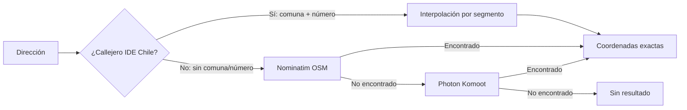
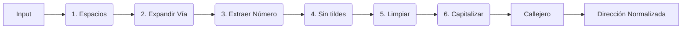

<div align="center">


# 🧭 Azimut

### Geocodificador & Normalizador de Direcciones Chilenas

*Sube un CSV, normaliza, geocodifica y exporta — todo desde el navegador, sin API keys.*

[](https://geoidegeoidal.github.io/azimut/)
[](https://github.com/geoidegeoidal/azimut)
[](https://github.com/geoidegeoidal/azimut)
[](https://github.com/geoidegeoidal/azimut)

<p align="center">
  <a href="https://geoidegeoidal.github.io/azimut/"><strong>🌎 Pruébalo aquí</strong></a>
  ·
  <a href="#-flujo">Flujo</a>
  ·
  <a href="#-geocodificación-en-3-capas">Geocodificación</a>
  ·
  <a href="#-normalizador">Normalizador</a>
  ·
  <a href="#-stack">Stack</a>
  ·
  <a href="#-tests">Tests</a>
</p>

</div>

---

## 🎯 ¿Qué hace?

<p align="center">
  
</p>

Azimut es una herramienta **100% client-side** para geocodificar direcciones chilenas. No requiere servidor, API keys ni configuración. Incluye el **Callejero Oficial de Chile (IDE Chile 2022)** como primera capa de geocodificación, con interpolación de numeración por segmento y corrección de typos mediante fuzzy matching.

---

## 🧭 Flujo

| Paso | Acción                             | Qué pasa                                                                                                          |
| :--: | ----------------------------------- | ------------------------------------------------------------------------------------------------------------------ |
|  1  | 📂**Sube tu archivo**         | Arrastra un CSV o XLSX — detectamos encoding, delimitador y columnas automáticamente                             |
|  2  | 🔍**Selecciona las columnas** | Te sugerimos la columna con direcciones y comuna, ves un preview de 10 filas normalizadas                          |
|  3  | ⚡**Geocodificamos**          | 3 capas: Callejero IDE Chile → Nominatim → Photon. Pausa, reanuda o cancela cuando quieras                         |
|  4  | 📊**Explora resultados**      | Dashboard con scores, mapa interactivo con marcadores coloreados, tabla filtrable con detalle                      |
|  5  | 📦**Exporta**                 | 4 formatos: CSV, XLSX (celdas coloreadas), GeoJSON, Shapefile (.zip)                                               |

---

## 🗺️ Geocodificación en 3 capas



### Capa 1: Callejero IDE Chile (Maestro de Calles 2022)

Primera capa de resolución — **no consume APIs externas**.

| Característica | Detalle |
| :------------- | :------ |
| **Fuente** | IDE Chile / SNIT — Maestro de Calles 2022 |
| **Cobertura** | 127.858 calles únicas en 151 comunas |
| **Segmentos** | 267.519 segmentos con numeración y geometría |
| **Resolución** | Interpolación lineal del número dentro del rango del segmento |

**Búsqueda en 3 fases:**

| Fase | Método | Ejemplo |
| :--: | :----- | :------ |
| 1 | **Match exacto** | `"avenida providencia"` → encuentra segmento directamente |
| 2 | **Fuzzy matching** | `"avenida providenciaa"` → Levenshtein corrige a `"avenida providencia"` |
| 3 | **Interpolación** | Número 1234 dentro de rango [1200–1300] → coordenada proporcional |

**Umbral dinámico de fuzzy matching:**

| Longitud del nombre | Distancia máxima permitida |
| :------------------ | :------------------------- |
| ≤ 16 chars | 2 |
| 17–24 chars | 2–3 |
| 25–32 chars | 3 |
| > 32 chars | 4 |

### Capa 2: Nominatim (OpenStreetMap)

Fallback cuando el callejero no puede resolver (sin comuna, sin número, o calle no encontrada).

### Capa 3: Photon (Komoot)

Último recurso si Nominatim falla.

---

## 🧹 Normalizador — 6 pasos



| Paso | Acción               | Qué resuelve                                                                        |
| :--: | --------------------- | ------------------------------------------------------------------------------------ |
|  1  | **Espacios**    | Elimina espacios duplicados al inicio, final e intermedios.                          |
|  2  | **Expandir**    | `Av.→Avenida`, `Pje→Pasaje`, `Cmno→Camino`, etc. (solo la primera palabra). |
|  3  | **Extraer Nº**  | Separa número de calle (`Providencia 1234` → calle + `1234`). Preserva `N°`, `#`, `Depto`. |
|  4  | **Sin tildes**  | Remueve acentos gráficos para simplificar la búsqueda.                             |
|  5  | **Limpiar**     | Elimina puntuación innecesaria al final (como comas o puntos sueltos).              |
|  6  | **Capitalizar** | Ajusta mayúsculas y minúsculas (ej. "Avenida Providencia").                        |

### Callejero cross-reference

Si se detecta la comuna, el normalizador:

- ✅ Valida que la calle exista en el callejero oficial de esa comuna
- 🔧 Corrige typos mediante fuzzy matching (Levenshtein ≤ 2)
- 🛣️ Corrige tipo de vía (ej. "Pasaje Ossa" → "Calle Ossa" si el callejero dice "Calle")
- ⚠️ Genera warnings si la calle no se encuentra en la comuna

### Antes → Después

| Input                          | Output                              |
| ------------------------------ | ----------------------------------- |
| `av. providencia 1234`       | `Avenida Providencia 1234`        |
| `pje los alerces 567 `       | `Pasaje Los Alerces 567`          |
| `CAMINO A MELIPILLA 25`      | `Camino A Melipilla 25`           |
| `AV libertador B. O'higgins` | `Avenida Libertador B. O'higgins` |
| `av providenciaa 1234`       | `Avenida Providencia 1234` *(corregido por callejero)* |

---

## 📊 Score 0–100

<p align="center">
  
</p>

Cada dirección recibe un puntaje compuesto de 4 factores:

```
SCORE = (MatchType × 0,4) + (Importancia × 0,3) + (Completitud × 0,2) + (Unicidad × 0,1)
```

| Sub-puntaje           | Peso | Ejemplo                                                                 |
| --------------------- | :--: | ----------------------------------------------------------------------- |
| **Match Type**  | 40% | `callejero=95` · `building=100` · `house_number=95` · `street=70` |
| **Importancia** | 30% | Relevancia OSM del resultado (0–1 × 100)                              |
| **Completitud** | 20% | % de tokens de tu dirección encontrados en el resultado                |
| **Unicidad**    | 10% | 1 solo match=100 · varios matches posibles=menos                       |

| Score |         Badge         | Significado                                |
| :----: | :-------------------: | ------------------------------------------ |
| ≥ 85 | 🟢**Excelente** | Calle y número exactos (callejero o OSM)   |
| 60–84 |   🟡**Bueno**   | Calle correcta, posible desfase en número |
| 35–59 |  🟠**Regular**  | Solo comuna o barrio identificado          |
|  < 35  |   🔴**Bajo**   | Match débil, revisar manualmente          |
|   0   |   ⚫**Nulo**   | Sin resultado                              |

---

## 🛠️ Stack

<div align="center">

| Capa                | Tecnología                              |
| :------------------ | :--------------------------------------- |
| **Framework** | React 19 · Vite 7 · TypeScript 5.8     |
| **Estilos**   | Tailwind CSS v4 · Framer Motion         |
| **Mapa**      | Leaflet · OpenStreetMap tiles           |
| **Archivos**  | SheetJS · PapaParse                     |
| **Geocoding** | Callejero IDE Chile · Nominatim · Photon |
| **Estado**    | Zustand · IndexedDB cache (30d)         |
| **Export**    | GeoJSON nativo ·`@crmackey/shp-write` |
| **Testing**   | Vitest · 47 tests                       |
| **Paquetes**  | pnpm (seguro, sin dependencias fantasma) |

</div>

---

## 📦 Datos embebidos

<div align="center">

| Tipo                     | Detalle                                                                                                             |
| :----------------------- | :------------------------------------------------------------------------------------------------------------------ |
| 🗺️ Callejero IDE Chile | 127.858 calles en 151 comunas + 267.519 segmentos con numeración (Maestro de Calles 2022) |
| 🛣️ Abreviaturas viales | Mapeo rápido de prefijos (`Av`→`Avenida`, `Pje`→`Pasaje`, `Cl`→`Calle`, `Cmno`→`Camino`, etc.) |
| ✍️ Non-capital words   | Exclusión de palabras menores al capitalizar (`de`, `la`, `el`, `los`, `las`, `y`, etc.)               |
| 🏘️ Comunas             | 346 comunas con aliases y fuzzy matching                                                                             |
| 🗺️ Regiones            | 16 regiones con aliases y normalización                                                                              |

</div>

---

## 🧪 Tests

```bash
pnpm install         # Instalar dependencias (seguro, sin scripts automáticos)
pnpm test            # 47 tests (normalizador · scorer · parser)
pnpm dev             # Dev en localhost:5173
pnpm build           # Build producción
pnpm lint            # ESLint
```

### Pre-procesar callejero

Si necesitas regenerar los datos del callejero desde el shapefile original:

```bash
node scripts/process-callejero.mjs
```

Esto lee `data/Maestro_de_Calles_2022.*` y genera:
- `src/data/callejero-names.json` — diccionario de calles por comuna (bundled, ~2.7 MB)
- `public/callejero-segments-index.json` — segmentos con numeración y geometría (cargado al iniciar, ~29 MB)

---

## ☕ Apoya este proyecto

Si este geocodificador te ha ahorrado horas de trabajo o simplemente te gusta la herramienta, puedes invitarme un café. ¡Toda ayuda es bienvenida para mantener y mejorar el proyecto!

<a href="https://link.mercadopago.cl/jorgeulloaroa" target="_blank">
  
</a>

---

## 📄 Licencia

MIT — hecho con 🧭 en Chile.

---

<div align="center">

**[🌎 Pruébalo ahora → geoidegeoidal.github.io/azimut](https://geoidegeoidal.github.io/azimut/)**

</div>
