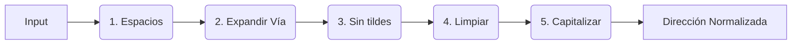

<div align="center">


# 🧭 Azimut

### Geocodificador & Normalizador de Direcciones Chilenas

*Sube un CSV, normaliza, geocodifica y exporta — todo desde el navegador, sin API keys.*

[](https://geoidegeoidal.github.io/azimut/)
[](https://github.com/geoidegeoidal/azimut)
[](https://github.com/geoidegeoidal/azimut)
[](https://github.com/geoidegeoidal/azimut)

<p align="center">
  <a href="https://geoidegeoidal.github.io/azimut/"><strong>🌎 Pruébalo aquí</strong></a>
  ·
  <a href="#-flujo">Flujo</a>
  ·
  <a href="#-normalizador">Normalizador</a>
  ·
  <a href="#-stack">Stack</a>
  ·
  <a href="#-tests">Tests</a>
</p>

</div>

---

## 🎯 ¿Qué hace?

<p align="center">
  
</p>

---

## 🧭 Flujo

| Paso | Acción                             | Qué pasa                                                                                                          |
| :--: | ----------------------------------- | ------------------------------------------------------------------------------------------------------------------ |
|  1  | 📂**Sube tu archivo**         | Arrastra un CSV o XLSX — detectamos encoding, delimitador y columnas automáticamente                             |
|  2  | 🔍**Selecciona las columnas** | Te sugerimos la columna con direcciones (puedes unir varias), ves un preview de 10 filas                           |
|  3  | ⚡**Geocodificamos**          | Procesamos 1 dirección por segundo con Nominatim (con fallback a Photon). Pausa, reanuda o cancela cuando quieras |
|  4  | 📊**Explora resultados**      | Dashboard con scores, mapa interactivo con marcadores coloreados, tabla filtrable con detalle                      |
|  5  | 📦**Exporta**                 | 4 formatos: CSV, XLSX (celdas coloreadas), GeoJSON, Shapefile (.zip)                                               |

---

## 🧹 Normalizador Rápido — 5 pasos



| Paso | Acción               | Qué resuelve                                                                        |
| :--: | --------------------- | ------------------------------------------------------------------------------------ |
|  1  | **Espacios**    | Elimina espacios duplicados al inicio, final e intermedios.                          |
|  2  | **Expandir**    | `Av.→Avenida`, `Pje→Pasaje`, `Cmno→Camino`, etc. (solo la primera palabra). |
|  3  | **Sin tildes**  | Remueve acentos gráficos para simplificar la búsqueda.                             |
|  4  | **Limpiar**     | Elimina puntuación innecesaria al final (como comas o puntos sueltos).              |
|  5  | **Capitalizar** | Ajusta mayúsculas y minúsculas (ej. "Avenida Providencia 1234").                   |

### Antes → Después

| Input                          | Output                              |
| ------------------------------ | ----------------------------------- |
| `av. providencia 1234`       | `Avenida Providencia 1234`        |
| `pje los alerces 567 `       | `Pasaje Los Alerces 567`          |
| `CAMINO A MELIPILLA 25`      | `Camino A Melipilla 25`           |
| `AV libertador B. O'higgins` | `Avenida Libertador B. O'higgins` |

---

## 📊 Score 0–100

<p align="center">
  
</p>

Cada dirección recibe un puntaje compuesto de 4 factores:

```
SCORE = (MatchType × 0,4) + (Importancia × 0,3) + (Completitud × 0,2) + (Unicidad × 0,1)
```

| Sub-puntaje           | Peso | Ejemplo                                                                 |
| --------------------- | :--: | ----------------------------------------------------------------------- |
| **Match Type**  | 40% | `building=100` · `house_number=95` · `street=70` · `city=25` |
| **Importancia** | 30% | Relevancia OSM del resultado (0–1 × 100)                              |
| **Completitud** | 20% | % de tokens de tu dirección encontrados en el resultado                |
| **Unicidad**    | 10% | 1 solo match=100 · varios matches posibles=menos                       |

| Score |         Badge         | Significado                                |
| :----: | :-------------------: | ------------------------------------------ |
| ≥ 85 | 🟢**Excelente** | Calle y número exactos                    |
| 60–84 |   🟡**Bueno**   | Calle correcta, posible desfase en número |
| 35–59 |  🟠**Regular**  | Solo comuna o barrio identificado          |
|  < 35  |   🔴**Bajo**   | Match débil, revisar manualmente          |
|   0   |   ⚫**Nulo**   | Sin resultado                              |

---

## 🛠️ Stack

<div align="center">

| Capa                | Tecnología                              |
| :------------------ | :--------------------------------------- |
| **Framework** | React 19 · Vite 7 · TypeScript 5.8     |
| **Estilos**   | Tailwind CSS v4 · Framer Motion         |
| **Mapa**      | Leaflet · OpenStreetMap tiles           |
| **Archivos**  | SheetJS · PapaParse                     |
| **Geocoding** | Nominatim · Photon*(sin API key)*     |
| **Estado**    | Zustand · IndexedDB cache (30d)         |
| **Export**    | GeoJSON nativo ·`@crmackey/shp-write` |
| **Testing**   | Vitest · 54 tests                       |

</div>

---

## 📦 Datos embebidos

<div align="center">

| Tipo                     | Detalle                                                                                                             |
| :----------------------- | :------------------------------------------------------------------------------------------------------------------ |
| 🛣️ Abreviaturas viales | Mapeo rápido de prefijos (`Av`→`Avenida`, `Pje`→`Pasaje`, `Cl`→`Calle`, `Cmno`→`Camino`, etc.) |
| ✍️ Non-capital words   | Exclusión de palabras menores al capitalizar (`de`, `la`, `el`, `los`, `las`, `y`, etc.)               |

</div>

---

## 🧪 Tests

```bash
npm install        # Instalar dependencias
npm test           # 54 tests (normalizador · scorer · parser)
npm run dev        # Dev en localhost:5173
npm run build      # Build producción
```

---

## ☕ Apoya este proyecto

Si este geocodificador te ha ahorrado horas de trabajo o simplemente te gusta la herramienta, puedes invitarme un café. ¡Toda ayuda es bienvenida para mantener y mejorar el proyecto!

<a href="https://link.mercadopago.cl/jorgeulloaroa" target="_blank">
  
</a>

---

## 📄 Licencia

MIT — hecho con 🧭 en Chile.

---

<div align="center">

**[🌎 Pruébalo ahora → geoidegeoidal.github.io/azimut](https://geoidegeoidal.github.io/azimut/)**

</div>
